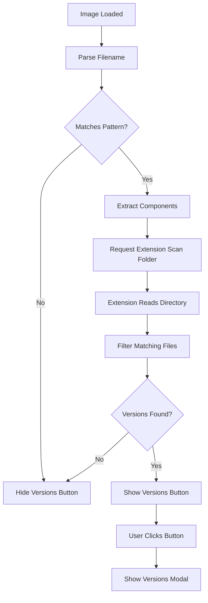
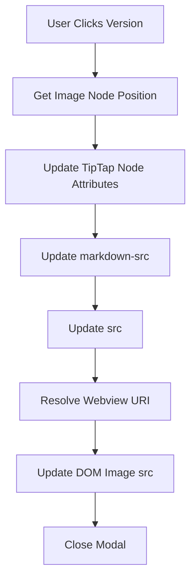

# Image Versions Browser Architecture

## Current State Analysis

**Current image button structure:**

- Resize button appears on image hover (top-right corner)
- Single button: `image-resize-icon` with `codicon-edit-sparkle`
- Positioned absolutely at `top: 8px, right: 8px`
- Only shows when image is loaded and hovered

**Current image naming (after context-preserving naming is implemented):**

- Format: `{source}_{name}_{timestamp}_{width}x{height}px.{ext}`
- Example: `dropped_cat-desktop_1700000000000_100x200px.png`
- Resize updates dimensions: `dropped_cat-desktop_1700000000000_50x100px.png`
- Same source + name + timestamp = related versions

**Current resize flow:**

- Resize creates backup: `{basename}-backup-{timestamp}.{ext}`
- Resize updates filename dimensions (preserves timestamp)
- Multiple resizes create multiple versions with same base name

## Desired Behavior

**Versions button:**

- Appears left of resize button (side-by-side)
- Only visible when other versions are detected
- Icon: `codicon-versions` or `codicon-layers` (version/history icon)
- Click opens versions modal

**Version detection:**

- Parse current image filename using regex: `/(dropped_|pasted_)?(.+?)_(\d+)_(\d+)x(\d+)px\.([^.]+)$/`
- Extract: source prefix, base name, timestamp, dimensions, extension
- Scan image folder for files matching: `{source}_{name}_{timestamp}_*x*px.{ext}`
- Find all versions (different dimensions, same base components)

**Versions modal:**

- Shows thumbnails of all detected versions
- Displays dimensions for each version
- Highlights current version
- Allows clicking to switch to selected version
- Shows file size and modification date if available

**Version switching:**

- Replace current image src with selected version
- Update TipTap node attributes
- Update markdown source path
- Maintain selection/cursor position

## Architecture Changes

### 1. Versions Button in CustomImage Extension

**File:** `src/webview/extensions/customImage.ts`

**Changes:**

- Add versions button element (similar to resize button)
- Position: `top: 8px, right: 40px` (left of resize button which is at `right: 8px`)
- Conditional visibility: Only show when versions detected
- Click handler: Call `setupImageVersions()` global function

**Implementation:**

```typescript
// Create versions icon button (shown on hover when versions exist)
const versionsIcon = document.createElement('button');
versionsIcon.className = 'image-versions-icon';
versionsIcon.setAttribute('aria-label', 'View image versions');
versionsIcon.setAttribute('title', 'View image versions');
versionsIcon.type = 'button';
versionsIcon.style.display = 'none'; // Hidden by default

// Icon element
const versionsIconSpan = document.createElement('span');
versionsIconSpan.className = 'codicon codicon-versions toolbar-icon uses-codicon';
versionsIcon.appendChild(versionsIconSpan);

// Check for versions on image load
checkImageVersions(dom, versionsIcon, vscodeApi);
```

### 2. Version Detection Logic

**File:** `src/webview/features/imageVersions.ts` (new)

**Functions:**

- `parseImageFilename(filename: string): ParsedImageInfo | null` - Parse filename using regex
- `checkImageVersions(img: HTMLImageElement, button: HTMLElement, vscodeApi: VsCodeApi): Promise<void>` - Check if versions exist, show/hide button
- `findImageVersions(imagePath: string, vscodeApi: VsCodeApi): Promise<ImageVersion[]>` - Request extension to scan folder

**ParsedImageInfo interface:**

```typescript
interface ParsedImageInfo {
  sourcePrefix: string; // 'dropped_' | 'pasted_' | ''
  baseName: string;     // 'cat-desktop'
  timestamp: string;    // '1700000000000'
  width: number;        // 100
  height: number;       // 200
  extension: string;    // 'png'
}
```

**ImageVersion interface:**

```typescript
interface ImageVersion {
  filename: string;
  relativePath: string;
  width: number;
  height: number;
  fileSize?: number;
  modifiedDate?: number;
  isCurrent: boolean;
}
```

### 3. Extension-Side Folder Scanning

**File:** `src/editor/MarkdownEditorProvider.ts`

**New handler:** `handleFindImageVersions()`

**Implementation:**

- Parse image path to get directory and filename
- Read directory contents using `vscode.workspace.fs.readDirectory()`
- Filter files matching pattern: `{source}_{name}_{timestamp}_*x*px.{ext}`
- Extract dimensions from each matching filename
- Return array of versions with metadata

**Message flow:**

```typescript
// Webview sends:
{
  type: 'findImageVersions',
  imagePath: './images/dropped_cat-desktop_1700000000000_100x200px.png',
  requestId: 'find-versions-123'
}

// Extension responds:
{
  type: 'imageVersionsFound',
  requestId: 'find-versions-123',
  versions: [
    {
      filename: 'dropped_cat-desktop_1700000000000_100x200px.png',
      relativePath: './images/dropped_cat-desktop_1700000000000_100x200px.png',
      width: 100,
      height: 200,
      isCurrent: true
    },
    {
      filename: 'dropped_cat-desktop_1700000000000_50x100px.png',
      relativePath: './images/dropped_cat-desktop_1700000000000_50x100px.png',
      width: 50,
      height: 100,
      isCurrent: false
    }
  ]
}
```

### 4. Versions Modal Dialog

**File:** `src/webview/features/imageVersionsModal.ts` (new)

**Features:**

- Modal overlay (similar to resize modal style)
- Grid layout showing thumbnails
- Each thumbnail shows:
  - Image preview (thumbnail)
  - Dimensions (e.g., "100 × 200px")
  - File size (if available)
  - "Current" badge for active version
- Click thumbnail to switch version
- Close button or click outside to dismiss

**UI Structure:**

```typescript
export async function showImageVersionsModal(
  img: HTMLImageElement,
  versions: ImageVersion[],
  editor: Editor,
  vscodeApi: VsCodeApi
): Promise<void>
```

### 5. Version Switching

**File:** `src/webview/features/imageVersionsModal.ts`

**Implementation:**

- On thumbnail click, update image src
- Update TipTap node attributes (`markdown-src` and `src`)
- Use placeholder ID pattern if available (for reliable updates)
- Update markdown document (via TipTap updateAttributes)

**Update flow:**

```typescript
// Find image node position
const pos = editor.view.posAtDOM(img, 0);

// Update node attributes
editor
  .chain()
  .setNodeSelection(pos)
  .updateAttributes('image', {
    src: newRelativePath,
    'markdown-src': newRelativePath,
  })
  .run();
```

### 6. CSS Styling

**File:** `src/webview/editor.css`

**New styles:**

- `.image-versions-icon` - Similar to `.image-resize-icon` but positioned at `right: 40px`
- `.image-versions-modal-overlay` - Modal overlay
- `.image-versions-grid` - Grid layout for thumbnails
- `.image-version-thumbnail` - Individual thumbnail styling
- `.image-version-current` - Highlight for current version

## Implementation Details

### Version Detection Flow



### Version Switching Flow



### File Structure Changes

**Modified files:**

1. `src/webview/extensions/customImage.ts`

   - Add versions button creation
   - Add version detection check on image load
   - Position button left of resize button

2. `src/webview/features/imageVersions.ts` (new)

   - Filename parsing utility
   - Version detection logic
   - Button visibility management

3. `src/webview/features/imageVersionsModal.ts` (new)

   - Modal dialog UI
   - Thumbnail grid
   - Version switching logic

4. `src/webview/editor.ts`

   - Add `setupImageVersions()` global function
   - Message handler for `imageVersionsFound`

5. `src/editor/MarkdownEditorProvider.ts`

   - Add `handleFindImageVersions()` message handler
   - Directory scanning logic
   - Filename pattern matching

6. `src/webview/editor.css`

   - Versions button styles
   - Modal styles
   - Thumbnail grid styles

## Edge Cases & Considerations

1. **No versions found:** Button remains hidden
2. **Malformed filenames:** Skip if pattern doesn't match (graceful degradation)
3. **External images:** Versions button not shown (only for local images)
4. **Workspace images:** Only scan if image is in workspace (use `checkImageInWorkspace` pattern)
5. **Performance:** Cache version detection results per image (avoid repeated scans)
6. **Large folders:** Limit scan to image folder (not recursive)
7. **Backup files:** Exclude `-backup-*` files from version list (only show active versions)

## Testing Strategy

1. **Unit tests:**

   - Filename parsing with various formats
   - Version detection logic
   - Pattern matching edge cases

2. **Integration tests:**

   - Button visibility based on version detection
   - Modal display with multiple versions
   - Version switching updates image correctly

3. **Manual testing:**

   - Create multiple versions by resizing
   - Verify button appears/disappears correctly
   - Test version switching
   - Test with external images (button should not appear)
   - Test with workspace images

## Success Criteria

✅ Versions button appears left of resize button when versions detected

✅ Button only shows for local images with matching pattern

✅ Modal displays all versions with thumbnails

✅ Current version is highlighted

✅ Clicking version switches image correctly

✅ Markdown source updates when version switched

✅ Performance: Version detection completes in <500ms

✅ Works with new naming format: `{source}_{name}_{timestamp}_{width}x{height}px.{ext}`